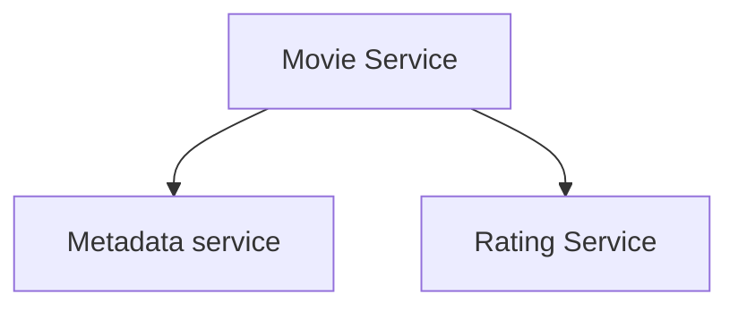

# FilmHive

---

电影应用
- Movie Service：向调用者提供有关一部电影或一组电影的完整信息，包括电影元数据及其评级。
- Metadata Service：通过电影ID存储和检索电影元数据记录。
- Rating Service：存储不同类型记录的评级并检索记录的聚合评级。

```mermaid
flowchart TD
    M[Movie Service]
    MD[Metadata service]
    R[Rating Service]
    M --> MD
    M --> R
```
